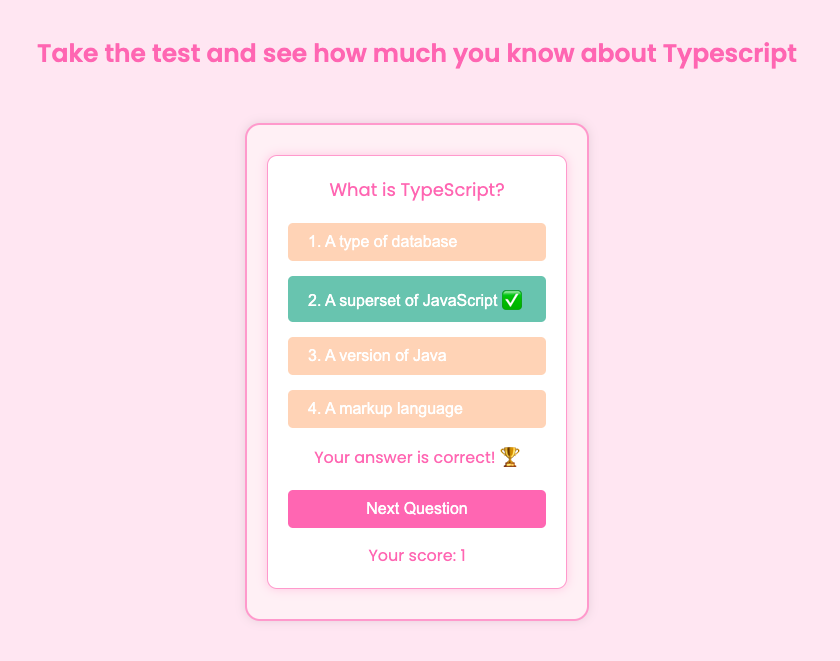

# TypeScript Quiz

Welcome to the TypeScript Quiz! This web application allows you to test your knowledge of TypeScript through a series of questions.

## Table of Contents

- [Demo](#demo)
- [Features](#features)
- [Technologies Used](#technologies-used)
- [Getting Started](#getting-started)
- [Usage](#usage)
- [License](#license)
- [Acknowledgements](#acknowledgements)

## Screenshot

## Demo

You can try out the quiz by visiting the [live demo](https://shakedown3000.github.io/typescript_quiz/).

## Features

- Start a quiz with questions about TypeScript.
- Multiple choice answers with instant feedback on correctness.
- Score tracking to see how many questions you answered correctly.
- Simple and clean UI with custom alert messages.

## Technologies Used

- HTML
- CSS
- TypeScript
- JavaScript

## Getting Started

To get a local copy up and running, follow these steps:

### Prerequisites

Make sure you have Node.js and npm installed. You can download them from [here](https://nodejs.org/).

### Installation

1. Clone the repository:
   git clone https://github.com/shakedown3000/typescript_quiz.git
2. Navigate to the project directory:
   cd typescript_quiz
3. Install the dependencies:
   npm install

### Running the Project

To start the project, run:
npm start
